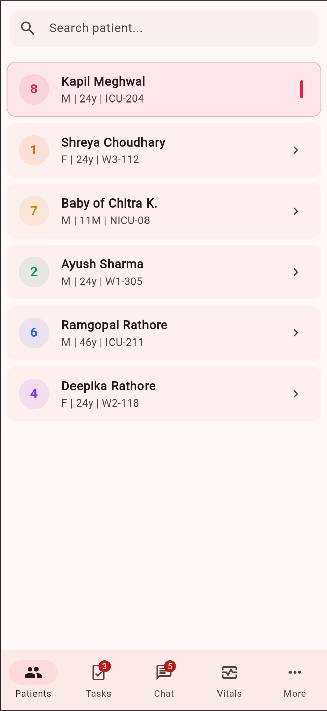
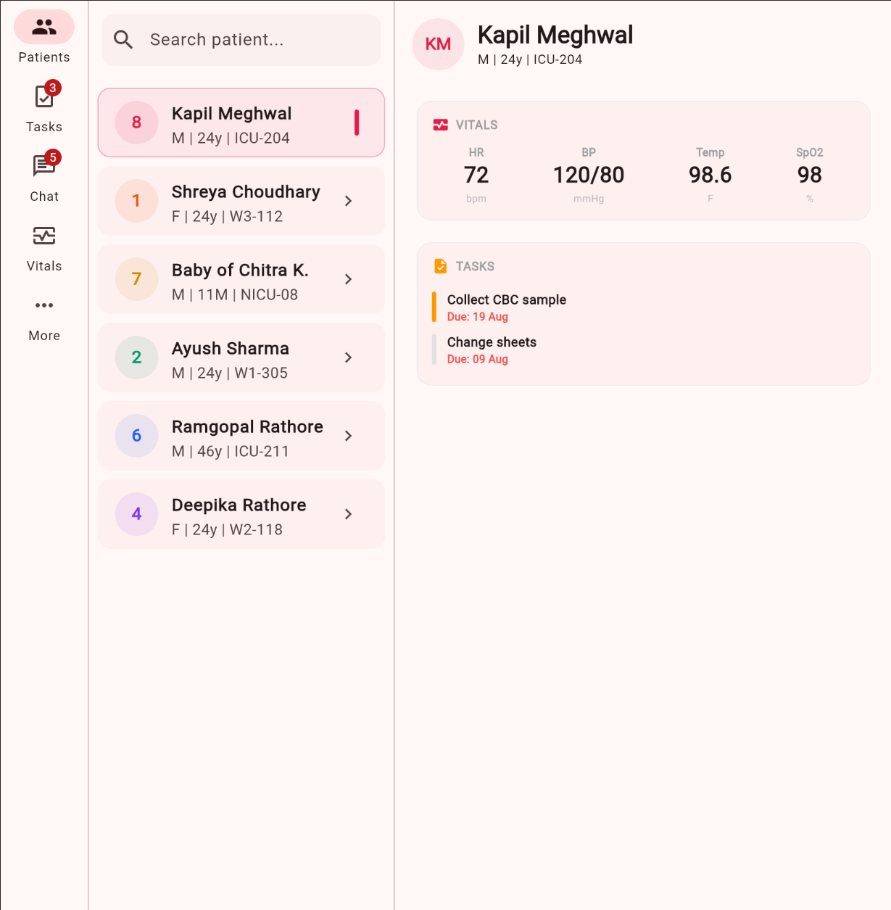

# adaptive_shell

[](https://pub.dev/packages/adaptive_shell)
[](https://opensource.org/licenses/BSD-3-Clause)

An adaptive master-detail layout wrapper for Flutter. Supply `child1` + `child2` and the package handles everything: responsive pane layout, navigation mode switching, and layout-aware navigation — across mobile, tablet, web, and desktop.

## Why adaptive_shell?

Building adaptive layouts in Flutter typically requires hundreds of lines of boilerplate: checking screen widths, conditionally rendering `NavigationBar` vs `NavigationRail`, managing master-detail panes, and handling navigation differently per platform. `adaptive_shell` reduces this to a single wrapper widget.

`flutter_adaptive_scaffold` (the official package) has been **discontinued**. `adaptive_shell` is a simpler, actively-maintained alternative with a more intuitive API.

## Screenshots

### Compact layout (Mobile)



### Expanded layout (Tablet/Desktop)



## Features

- **Single wrapper widget** — just provide `child1` + `child2`
- **Automatic navigation** — `NavigationBar` on mobile, `NavigationRail` on tablet/web
- **Master-detail split** — `child1` always visible; `child2` shown beside it on larger screens
- **Layout awareness** — `AdaptiveShell.of(context)` returns the current mode so descendants can decide between pushing routes or updating state
- **Context extensions** — `context.isCompact`, `context.isTwoPane`, `context.adaptiveWidth()`, `context.adaptiveColumns`, `context.adaptiveValue()` and more for clean, readable code
- **AdaptiveBuilder** — standalone `LayoutBuilder`-powered widget that picks between compact/medium/expanded builders without needing an `AdaptiveShell` ancestor
- **Keyboard shortcuts** — `keyboardShortcuts` map lets users navigate via `Ctrl+1`, `Ctrl+2`, etc. on tablet/desktop
- **Collapsible rail** — `railCollapsible: true` adds a chevron toggle; `railCollapseOnMedium` auto-collapses on tablet; destinations scroll gracefully on short screens instead of overflowing
- **Custom pane divider** — `paneDivider` replaces the default `VerticalDivider` between master and detail panes
- **AutoScale**  — `autoScale: true` scales your mobile design proportionally to fill any screen, just like `responsive_framework`'s AutoScale
- **State persistence**  — `persistState: true` preserves scroll positions and widget state when the device rotates or the layout mode changes
- **Animated transitions**  — `transitionCurve` and `enableHeroAnimations` for polished detail-pane animation
- **Layout change callback** — `onLayoutModeChanged` fires when the layout transitions, useful for analytics or state management
- **Debug overlay** — `debugShowLayoutMode: true` shows a live overlay with current mode, breakpoints, and auto-scale factor during development
- **Material 3 compliant** — follows M3 window size classes (compact / medium / expanded)
- **Badge support** — navigation destinations support notification counts
- **All platforms** — Android, iOS, web, macOS, Windows, Linux

## Layout behavior

```
Compact (<600dp)          Medium (600–1200dp)         Expanded (>1200dp)
┌─────────────────┐       ┌──┬────────┬──────────┐    ┌─────────┬────────┬──────────┐
│                 │       │  │        │          │    │ Rail    │        │          │
│    child1       │       │R │ child1 │  child2  │    │(labels) │ child1 │  child2  │
│   (fullscreen)  │       │a │ (35%)  │  (65%)   │    │         │ (35%)  │  (65%)   │
│                 │       │i │        │          │    │         │        │          │
│                 │       │l │        │          │    │         │        │          │
├─────────────────┤       └──┴────────┴──────────┘    └─────────┴────────┴──────────┘
│  BottomNavBar   │
└─────────────────┘
```

## Getting started

Add to your `pubspec.yaml`:

```yaml
dependencies:
  adaptive_shell: ^1.1.0
```

## Usage

### Basic setup

```dart
import 'package:adaptive_shell/adaptive_shell.dart';

class HomeScreen extends StatefulWidget {
  const HomeScreen({super.key});

  @override
  State<HomeScreen> createState() => _HomeScreenState();
}

class _HomeScreenState extends State<HomeScreen> {
  int _navIndex = 0;
  Patient? _selected;

  void _onPatientTap(Patient patient) {
    // Check current layout to decide navigation strategy
    if (AdaptiveShell.of(context) == LayoutMode.compact) {
      // Mobile: push a new screen
      Navigator.push(context, MaterialPageRoute(
        builder: (_) => PatientDetailScreen(patient: patient),
      ));
    } else {
      // Tablet/web: update child2 in-place
      setState(() => _selected = patient);
    }
  }

  @override
  Widget build(BuildContext context) {
    return AdaptiveShell(
      destinations: const [
        AdaptiveDestination(icon: Icons.people, label: 'Patients'),
        AdaptiveDestination(icon: Icons.task, label: 'Tasks', badge: 3),
        AdaptiveDestination(icon: Icons.chat, label: 'Chat'),
      ],
      selectedIndex: _navIndex,
      onDestinationSelected: (i) => setState(() => _navIndex = i),
      child1: PatientListScreen(onTap: _onPatientTap),
      child2: _selected != null
        ? PatientDetailScreen(patient: _selected!)
        : null,
      emptyDetailPlaceholder: const Center(
        child: Text('Select a patient'),
      ),
    );
  }
}
```

### Reading layout mode in descendants

```dart
// In any descendant widget:
final mode = AdaptiveShell.of(context);
// Returns LayoutMode.compact, .medium, or .expanded

// Or use the convenience helper:
if (AdaptiveShell.isTwoPane(context)) {
  // Show selected highlight, hide chevron, etc.
}
```

### Context extensions (v1.1.0)

Quick, readable access to layout information anywhere in the widget tree:

```dart
// Boolean checks
if (context.isCompact) { /* mobile */ }
if (context.isMedium) { /* tablet */ }
if (context.isExpanded) { /* desktop */ }

// Semantic aliases
if (context.isMobile) { /* same as isCompact */ }
if (context.isTablet) { /* medium or expanded */ }
if (context.isDesktop) { /* same as isExpanded */ }
if (context.isTwoPane) { /* two panes visible */ }

// Adaptive sizing
final width  = context.adaptiveWidth(300);     // 300 / 360 / 450
final height = context.adaptiveHeight(200);    // 200 / 230 / 260
final size   = context.adaptiveFontSize(16);   // 16 / 17.6 / 19.2
final space  = context.adaptiveSpacing(8);     // 8 / 10 / 12
final pad    = context.adaptivePadding();      // 16 / 24 / 32

// Custom padding thresholds
final pad2 = context.adaptivePadding(compact: 12, medium: 20, expanded: 28);
```

> **Note:** If you already define any of these names as `BuildContext` extensions in your own code, Dart will raise an ambiguity error. You can resolve it with a hide import:
> ```dart
> import 'package:adaptive_shell/adaptive_shell.dart' hide AdaptiveContextExtensions;
> ```

### Layout change callback (v1.1.0)

React to layout mode transitions for analytics, state resets, or logging:

```dart
AdaptiveShell(
  onLayoutModeChanged: (oldMode, newMode) {
    debugPrint('Layout: $oldMode → $newMode');
    analytics.logEvent('layout_change', {'mode': newMode.name});
  },
  // ...
)
```

### Debug overlay (v1.1.0)

Show a live overlay with the current mode, screen width, and breakpoint thresholds:

```dart
AdaptiveShell(
  debugShowLayoutMode: true, // remove before shipping
  // ...
)
```

### AutoScale (v1.1.0) 📏

Scale your mobile design proportionally to fill any screen size — without writing a single media query. Think of it as "zoom to fit":

```dart
AdaptiveShell(
  autoScale: true,             // render at 360 dp design canvas, scale to screen
  scaleFactor: 1.0,            // optional multiplier (default 1.0 = exact fit)
  autoScaleDesignWidth: 390,   // optional: override canvas (e.g. iPhone 14 = 390)
  // ...
)
```

| Parameter | Default | Effect |
|---|---|---|
| `autoScale` | `false` | Enables proportional scaling |
| `scaleFactor` | `1.0` | Multiplier on top of auto scale |
| `autoScaleDesignWidth` | `360 dp` | Reference canvas width |

The debug overlay shows a live `⚖️ Scale ×N.NN` value when `autoScale` is on.

### State persistence (v1.1.0) 💾

Preserve scroll positions and widget state when the device rotates or the layout switches between compact and wide:

```dart
AdaptiveShell(
  persistState: true,
  stateKey: 'my_shell',   // optional — disambiguates multiple shells in one tree
  // ...
)
```

Internally uses stable `GlobalKey`s for `child1`/`child2` (element subtrees survive layout transitions) and a `PageStorage` bucket (scroll restoration for any scrollable using a `PageStorageKey`).

### Animated transitions (v1.1.0) ✨

Customise the curve and style of the detail-pane transition:

```dart
AdaptiveShell(
  transitionCurve: Curves.easeInOutCubic,   // default: Curves.easeInOut
  enableHeroAnimations: true,               // slide + fade instead of cross-fade
  transitionDuration: const Duration(milliseconds: 400),
  // ...
)
```

`enableHeroAnimations: true` gives a subtle 5 % horizontal slide + fade as the incoming detail content arrives — no `Hero` tags required.

### AdaptiveBuilder (v1.1.0) 🏗️

A standalone responsive builder — no `AdaptiveShell` ancestor required. Uses `LayoutBuilder` and `AdaptiveBreakpoints` directly:

```dart
AdaptiveBuilder(
  compact:  (context) => MobileView(),
  medium:   (context) => TabletView(),   // optional — falls back to compact
  expanded: (context) => DesktopView(),  // optional — falls back to medium
  breakpoints: AdaptiveBreakpoints.tabletFirst, // optional custom breakpoints
)
```

Useful for one-off responsive widgets deep in the tree that shouldn't depend on an `AdaptiveShell` being present.

### Keyboard shortcuts (v1.1.0) ⌨️

Map any `ShortcutActivator` to a navigation destination index. Shortcuts are only active on medium/expanded layouts (tablet / desktop); they are silently ignored on compact:

```dart
AdaptiveShell(
  keyboardShortcuts: {
    SingleActivator(LogicalKeyboardKey.digit1, control: true): 0,
    SingleActivator(LogicalKeyboardKey.digit2, control: true): 1,
    SingleActivator(LogicalKeyboardKey.digit3, control: true): 2,
  },
  // ...
)
```

### Collapsible navigation rail (v1.1.0) 📍

Show a chevron toggle above the rail destinations so users can collapse to icon-only mode:

```dart
AdaptiveShell(
  railCollapsible: true,         // shows ‹ / › toggle button above destinations
  railCollapseOnMedium: true,    // auto-collapses when entering tablet breakpoint
  // ...
)
```

| State | `extended` | `labelType` |
|---|---|---|
| Expanded, not collapsed | `true` | `none` (labels inline) |
| Medium, not collapsed | `false` | `all` (labels below icons) |
| Collapsed (any mode) | `false` | `none` (icons only) |

> **Short-screen behaviour:** when the toggle is shown and many destinations are present, the rail scrolls vertically instead of overflowing — so even 5+ destinations on a compact-height screen render without a `RenderFlex` overflow assertion.

### Custom pane divider (v1.1.0) ➗

Replace the default `VerticalDivider` between the master and detail panes with any widget:

```dart
AdaptiveShell(
  showPaneDivider: true,                              // must be true (default)
  paneDivider: VerticalDivider(width: 2, color: Colors.blue),
  // ...
)
```

### New context extensions (v1.1.0)

```dart
context.layoutMode      // LayoutMode enum (same as screenType, works in switch)
context.adaptiveColumns // 1 / 2 / 3 for compact / medium / expanded

// Any typed value per breakpoint:
final padding = context.adaptiveValue(compact: 8.0, medium: 16.0, expanded: 24.0);
final label   = context.adaptiveValue(compact: 'Mobile', medium: 'Tablet', expanded: 'Desktop');
final widget  = context.adaptiveValue<Widget>(
  compact:  const Icon(Icons.phone),
  medium:   const Icon(Icons.tablet),
  expanded: const Icon(Icons.desktop_mac),
);
```

### Custom breakpoints

```dart
AdaptiveShell(
  // Switch to two-pane earlier for tablet-first apps
  breakpoints: AdaptiveBreakpoints.tabletFirst,
  // ...
)

// Or fully custom:
AdaptiveShell(
  breakpoints: const AdaptiveBreakpoints(
    compact: 500,
    medium: 700,
    expanded: 960,
    masterRatio: 0.4, // 40% master, 60% detail
  ),
  // ...
)
```

### NavigationRail customization

```dart
AdaptiveShell(
  railLeading: FloatingActionButton.small(
    onPressed: _addPatient,
    child: const Icon(Icons.add),
  ),
  railTrailing: const Icon(Icons.settings),
  railBackgroundColor: Colors.grey.shade50,
  // ...
)
```

## API reference

### AdaptiveShell

| Property | Type | Default | Description |
|---|---|---|---|
| `child1` | `Widget` | required | Primary content, always visible |
| `child2` | `Widget?` | `null` | Detail content, shown on larger screens |
| `destinations` | `List<AdaptiveDestination>` | required | Navigation items (min 2) |
| `selectedIndex` | `int` | required | Currently selected nav index |
| `onDestinationSelected` | `ValueChanged<int>` | required | Nav tap callback |
| `breakpoints` | `AdaptiveBreakpoints` | M3 defaults | Breakpoint thresholds |
| `showPaneDivider` | `bool` | `true` | Divider between panes |
| `railLeading` | `Widget?` | `null` | Widget above rail items |
| `railTrailing` | `Widget?` | `null` | Widget below rail items |
| `railBackgroundColor` | `Color?` | `null` | Rail background |
| `appBar` | `PreferredSizeWidget?` | `null` | Top app bar |
| `transitionDuration` | `Duration` | 300ms | Pane animation speed |
| `floatingActionButton` | `Widget?` | `null` | FAB widget |
| `emptyDetailPlaceholder` | `Widget?` | `null` | Shown when child2 is null on large screens |
| `onLayoutModeChanged` | `void Function(LayoutMode, LayoutMode)?` | `null` | Called when layout mode transitions |
| `debugShowLayoutMode` | `bool` | `false` | Shows a live debug overlay in the top-right corner |
| `autoScale` | `bool` | `false` | Proportionally scales layout to fill screen  |
| `scaleFactor` | `double` | `1.0` | Multiplier on top of auto-computed scale  |
| `autoScaleDesignWidth` | `double?` | `360 dp` | Reference canvas width for scaling  |
| `persistState` | `bool` | `false` | Preserve widget state across layout transitions  |
| `stateKey` | `String?` | `'adaptive_shell'` | Namespace for PageStorage bucket  |
| `transitionCurve` | `Curve?` | `Curves.easeInOut` | Detail-pane AnimatedSwitcher curve  |
| `enableHeroAnimations` | `bool` | `false` | Slide + fade transition for detail pane  |
| `paneDivider` | `Widget?` | `null` | Custom divider between master and detail panes  |
| `railCollapsible` | `bool` | `false` | Adds a chevron toggle to collapse the rail  |
| `railCollapseOnMedium` | `bool` | `false` | Auto-collapses rail when entering medium mode  |
| `keyboardShortcuts` | `Map<ShortcutActivator, int>?` | `null` | Shortcut → destination index map (tablet/desktop)  |

### AdaptiveMasterDetail

Zero-boilerplate alternative. Inherits all `AdaptiveShell` properties above, plus:

| Property | Type | Default | Description |
|---|---|---|---|
| `items` | `List<T>` | required | Data items for the master list |
| `itemBuilder` | `MasterItemBuilder<T>` | required | Builds each list item |
| `detailBuilder` | `DetailBuilder<T>` | required | Builds the detail view |
| `selectedNavIndex` | `int` | required | Currently selected nav index |
| `onNavSelected` | `ValueChanged<int>` | required | Nav tap callback |
| `itemKey` | `Object Function(T)?` | `null` | Unique key per item (defaults to hashCode) |
| `initialSelection` | `T Function(List<T>)?` | `null` | Pre-selects an item on first build |
| `detailAppBarTitle` | `String Function(T)?` | `null` | Title for mobile detail AppBar |
| `masterHeader` | `Widget?` | `null` | Widget above the master list (e.g. search bar) |
| `masterBuilder` | `Widget Function(...)?` | `null` | Fully custom master pane builder |
| `compactDetailScaffoldBuilder` | `Widget Function(...)?` | `null` | Custom scaffold for mobile detail push |

### AdaptiveBuilder

Standalone responsive builder. Does **not** require an `AdaptiveShell` ancestor.

| Property | Type | Default | Description |
|---|---|---|---|
| `compact` | `WidgetBuilder` | required | Builder for compact screens |
| `medium` | `WidgetBuilder?` | `null` | Builder for medium screens (falls back to `compact`) |
| `expanded` | `WidgetBuilder?` | `null` | Builder for expanded screens (falls back to `medium`) |
| `breakpoints` | `AdaptiveBreakpoints` | M3 defaults | Breakpoint thresholds |

### AdaptiveContextExtensions

Extensions on `BuildContext` for concise layout-aware code. Require a `BuildContext` inside an `AdaptiveShell` subtree.

| Extension | Returns | Description |
|---|---|---|
| `context.screenType` | `LayoutMode` | Current layout mode |
| `context.layoutMode` | `LayoutMode` | Alias for `screenType`  |
| `context.isCompact` | `bool` | `true` on mobile (< compact bp) |
| `context.isMedium` | `bool` | `true` on tablet (compact–expanded bp) |
| `context.isExpanded` | `bool` | `true` on desktop (≥ expanded bp) |
| `context.isMobile` | `bool` | Alias for `isCompact` |
| `context.isTablet` | `bool` | `true` if medium or expanded |
| `context.isDesktop` | `bool` | Alias for `isExpanded` |
| `context.isTwoPane` | `bool` | `true` if two panes are visible |
| `context.adaptiveWidth(base)` | `double` | `base` × 1.0 / 1.2 / 1.5 |
| `context.adaptiveHeight(base)` | `double` | `base` × 1.0 / 1.15 / 1.3 |
| `context.adaptiveFontSize(base)` | `double` | `base` × 1.0 / 1.1 / 1.2 |
| `context.adaptiveSpacing(base)` | `double` | `base` × 1.0 / 1.25 / 1.5 |
| `context.adaptivePadding(...)` | `EdgeInsets` | 16 / 24 / 32 (customisable) |
| `context.adaptiveColumns` | `int` | Grid columns: 1 / 2 / 3  |
| `context.adaptiveValue<T>(...)` | `T` | Typed value per breakpoint  |

### AdaptiveBreakpoints

| Preset | Compact | Medium | Expanded | Master ratio |
|---|---|---|---|---|
| `material3` | 600 | 840 | 1200 | 35% |
| `tabletFirst` | 500 | 700 | 960 | 38% |

### LayoutMode

| Value | Screen width | Navigation | Panes |
|---|---|---|---|
| `compact` | < compact | `NavigationBar` | 1 (child1 only) |
| `medium` | compact – expanded | `NavigationRail` (icons) | 2 |
| `expanded` | >= expanded | `NavigationRail` (labels) | 2 |

## Design guidelines

This package follows recommendations from:

- [Flutter Adaptive & Responsive Design](https://docs.flutter.dev/ui/adaptive-responsive)
- [Flutter Best Practices](https://docs.flutter.dev/ui/adaptive-responsive/best-practices)
- [Material 3 Window Size Classes](https://m3.material.io/foundations/layout/applying-layout/window-size-classes)

Principles applied:

- Uses `LayoutBuilder`, never checks device type or locks orientation
- Material 3 window size classes for breakpoints
- `NavigationBar` on compact, `NavigationRail` on medium/expanded
- Preserves child widget state across layout changes
- Supports keyboard, mouse, and touch input

## Comparison with alternatives

| | adaptive_shell | flutter_adaptive_scaffold |
|---|---|---|
| Status | Active | **Discontinued** |
| API | `child1` / `child2` | Slot-based configs |
| Nav switching | Automatic | Manual per breakpoint |
| Layout awareness | `AdaptiveShell.of(context)` | None |
| Lines to set up | ~20 | ~100+ |

## Additional information

- **Issues**: [GitHub Issues](https://github.com/RakeshGowdaR/adaptive_shell/issues)
- **Contributing**: PRs welcome. Please open an issue first for major changes.
- **License**: BSD-3-Clause
